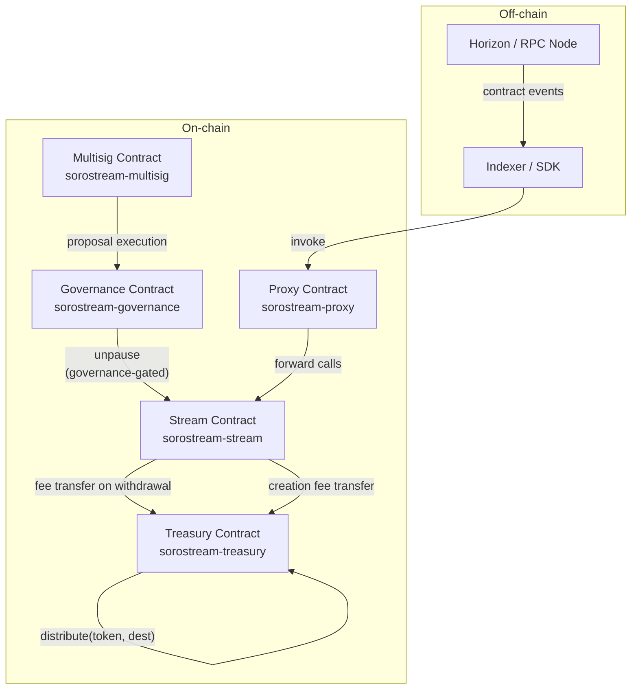

# SoroStream Architecture

## Stream Lifecycle State Machine

Every stream begins in the `Active` state immediately after `create_stream` succeeds. The diagram below shows all valid states and the instructions that trigger each transition.

```mermaid
stateDiagram-v2
    [*] --> Active : create_stream\n(sender locks deposit)

    Active --> Paused : pause_stream\n[caller = sender]
    Paused --> Active : resume_stream\n[caller = sender]\nend_time extended by paused duration

    Active --> Cancelled : cancel_stream\n[caller = sender or delegate]\nearned tokens → recipient\nremainder → sender

    Paused --> Cancelled : cancel_stream\n[caller = sender or delegate]\nearned tokens frozen at last_pause_time

    Active --> Cancelled : partial_cancel_stream\n[caller = sender or delegate]\ncreates a new smaller Active stream

    Active --> Cancelled : recipient_terminate\n[allow_recipient_termination = true]

    Paused --> Cancelled : recipient_terminate\n[allow_recipient_termination = true]

    Active --> Completed : withdraw\n[now ≥ end_time, auto_renew = false]\nall tokens distributed and stream removed

    Active --> Active : withdraw\n[auto_renew = true, sender has balance]\nnew epoch starts; end_time += duration

    Active --> Completed : withdraw\n[auto_renew = true, sender balance insufficient]\nAutoRenewFailed emitted

    Cancelled --> [*] : stream removed from storage
    Completed --> [*] : stream removed from storage

    Active --> [*] : archive_stream\n[fully settled: total_withdrawn + dust = deposit]
    Completed --> [*] : archive_stream
```



### State Descriptions

| State | Meaning |
|-------|---------|
| `Active` | Tokens are flowing; the recipient accrues `flow_rate` stroops per second. |
| `Paused` | Flow is frozen at `last_pause_time`; no new tokens accrue. `end_time` will be extended by the paused duration on resume. |
| `Cancelled` | The stream was ended early. Earned tokens went to the recipient; the unstreamed remainder returned to the sender. The storage entry is deleted. |
| `Completed` | The stream reached its natural `end_time`. All tokens have been distributed. The storage entry is deleted. |

### Guard Conditions

| Transition | Guard |
|-----------|-------|
| `pause_stream` | Caller must be the stream's `sender`. Stream must be `Active`. Contract must not be globally paused. |
| `resume_stream` | Caller must be the stream's `sender`. Stream must be `Paused`. Contract must not be globally paused. |
| `cancel_stream` | Caller must be `sender` or the appointed `delegate`. Stream must be `Active` or `Paused`. |
| `partial_cancel_stream` | Same as `cancel_stream`. `cancel_amount < remaining` and `remaining - cancel_amount ≥ flow_rate`. |
| `recipient_terminate` | `allow_recipient_termination` flag must be `true` on the stream. Caller must be the stream's `recipient`. |
| `withdraw` (mid-stream) | Caller must be `recipient`. Stream must be `Active`. `now ≥ cliff_time`. `now ≥ lock_until`. Withdrawal cooldown (if set) must have elapsed. |
| `withdraw` (auto-renew success) | Above, plus `now ≥ end_time`, `auto_renew = true`, sender balance ≥ deposit. Requires sender auth. |
| `archive_stream` | Caller must be `sender` or `recipient`. `total_withdrawn + dust = deposit` (stream fully settled). |

---

## Contract System Overview

The protocol is split across five contracts. The arrows show call relationships.



### Contract Roles

| Contract | Role |
|----------|------|
| `stream` | Core payment streaming logic: create, withdraw, cancel, top-up, pause, fee collection. |
| `treasury` | Holds accumulated protocol fees. Supports `deposit`, `withdraw_treasury`, `withdraw_all`, and `distribute` (treasury/LP split). |
| `governance` | Time-locked admin actions; can call `unpause` on the stream contract. |
| `multisig` | Multi-signature threshold for executing governance proposals. |
| `proxy` | Transparent upgrade proxy; forwards calls to the current stream contract implementation. |

---

## Stream ID Generation

### Algorithm

Stream IDs are derived deterministically from the creation parameters using SHA-256.
The full implementation lives in `contracts/stream/src/storage.rs` (`derive_stream_id`).

#### Inputs

| Field | Type | Encoding | Width |
|-------|------|----------|-------|
| `sender` | `Address` | Soroban XDR serialisation (`to_xdr`) | variable |
| `recipient` | `Address` | Soroban XDR serialisation (`to_xdr`) | variable |
| `start_time` | `u64` | 8-byte big-endian (`to_be_bytes`) | 8 bytes |
| `nonce` | `u64` | 8-byte big-endian (`to_be_bytes`) | 8 bytes |

#### Computation

```
preimage   = sender_xdr ‖ recipient_xdr ‖ start_time_be8 ‖ nonce_be8
hash       = SHA-256(preimage)             // 32-byte digest
stream_id  = u64::from_be_bytes(hash[0..8])
```

The first 8 bytes of the SHA-256 digest are interpreted as a big-endian unsigned 64-bit
integer. This value is used as both the persistent storage key for the `Stream` struct
and as the externally visible stream identifier returned to callers.

#### Reference implementation

```rust
// contracts/stream/src/storage.rs
pub fn derive_stream_id(
    env: &Env,
    sender: &Address,
    recipient: &Address,
    start_time: u64,
    nonce: u64,
) -> u64 {
    let mut buf = Bytes::new(env);
    buf.append(&sender.to_xdr(env));
    buf.append(&recipient.to_xdr(env));
    buf.append(&Bytes::from_array(env, &start_time.to_be_bytes()));
    buf.append(&Bytes::from_array(env, &nonce.to_be_bytes()));
    let hash       = env.crypto().sha256(&buf);
    let hash_bytes = hash.to_array();
    u64::from_be_bytes([
        hash_bytes[0], hash_bytes[1], hash_bytes[2], hash_bytes[3],
        hash_bytes[4], hash_bytes[5], hash_bytes[6], hash_bytes[7],
    ])
}
```

#### Uniqueness enforcement

A raw hash-derived ID provides probabilistic uniqueness (see analysis below). To
guarantee that the same `(sender, recipient, start_time, nonce)` tuple cannot be
used twice — even if the hash happened to collide — the contract checks for an
existing stream at the computed ID and reverts with `DuplicateStream` if one is
found:

```
if stream_exists(env, stream_id) {
    return Err(StreamError::DuplicateStream);
}
```

Callers must therefore supply a distinct `nonce` for each new stream. The contract
provides `get_nonce(sender)` which returns the next expected nonce for use with
`batch_create_stream`. For single-stream creation, any `u64` that has not already
been used with the same `(sender, recipient, start_time)` triple is acceptable.

---

### Collision Probability Analysis

#### Truncation to 64 bits

SHA-256 produces 256 bits of output. Only the first 64 bits are used as the stream
ID. The security of the scheme against *accidental* collisions is therefore bounded
by the birthday paradox applied to a 64-bit space.

#### Birthday-bound collision probability

For `n` independently derived stream IDs drawn from a uniform 64-bit space:

```
P(collision | n streams) ≈ 1 − e^(−n²/(2 × 2^64))
                         ≈ n² / (2 × 2^64)        (small n approximation)
```

Concrete figures:

| Total streams created | Collision probability |
|-----------------------|-----------------------|
| 1,000 | ~2.7 × 10⁻¹¹ (negligible) |
| 1,000,000 | ~2.7 × 10⁻⁵ (negligible) |
| 1,000,000,000 | ~2.7 × 10¹ — ~1 expected collision |
| 4,294,967,296 (2³²) | ~50 % chance of at least one collision |

At realistic protocol usage (tens of thousands of streams per year), the accidental
collision probability is astronomically small. The explicit `stream_exists` duplicate
check additionally protects against the vanishingly rare event that an accidental
collision does occur: the second creation call simply reverts, and the sender retries
with a different nonce.

#### Input entropy

Even if the 64-bit output were smaller, an adversary cannot *control* the hash output
without controlling the preimage. The preimage includes the XDR-serialised `Address`
of both the sender and the recipient. Stellar addresses are 32-byte Ed25519 public
keys; their XDR encoding adds type tags and length prefixes. The sender is always the
transaction signer, so an adversary who is not the sender cannot predict the sender's
address contribution to the preimage.

---

### Adversarial Pre-Image Analysis

#### Threat model

An adversary wishes to cause one of:

1. **Collision attack** — force two different legitimate creation calls to produce the
   same stream ID, causing one to revert as `DuplicateStream` (denial-of-service).
2. **Pre-image prediction** — predict the stream ID that will be assigned to a
   future stream in order to pre-populate state or front-run state changes that key
   off the stream ID.
3. **Second pre-image attack** — given a known stream ID, find different inputs that
   hash to the same 64-bit value in order to hijack an existing stream's storage slot.

#### Attack 1: Forced collision (DoS via `DuplicateStream`)

To force a `DuplicateStream` error for a victim's stream, the adversary must:

1. Know the victim's `(sender, recipient, start_time, nonce)` tuple *before* the
   victim's transaction is confirmed, **and**
2. Submit a transaction with the same tuple that is confirmed first.

**Requirement (1)** is non-trivial: the adversary must observe the pending transaction
in the mempool and extract the four fields. On Stellar, transactions in the mempool
are visible via Horizon, so this is theoretically possible for an observer with
real-time access to the fee-bump queue.

**Requirement (2)** requires the adversary to be the transaction signer, since
`sender.require_auth()` is enforced. The adversary cannot replay the victim's
transaction verbatim — they would need to craft their own transaction as a different
sender, but then the `sender` field in the preimage differs, producing a different
hash. There is no mechanism by which an adversary who is *not* the victim's sender
can create a stream on the victim's behalf.

**Conclusion:** Forced collision is not feasible against a victim who controls their
own signing key. The only realistic DoS vector is a frontrun by the victim's own
sender key, which is self-defeating.

#### Attack 2: Stream ID prediction

Because the hash function is deterministic and the inputs are known to both the
sender and the recipient, *both parties can predict* the stream ID before the
transaction is confirmed. This is intentional behaviour that enables:

- Off-chain indexers to subscribe to events by stream ID before confirmation.
- Recipient-side UIs to display pending streams.
- `batch_create_stream` callers to pre-compute IDs for all streams in the batch.

An external observer who knows `(sender, recipient, start_time, nonce)` can also
predict the ID. This is not a vulnerability because stream IDs are **not** used as
authorization tokens or secrets — every mutation (`withdraw`, `cancel_stream`, etc.)
requires `require_auth()` from the appropriate party regardless of whether the caller
knows the ID.

**Conclusion:** ID predictability is a design property, not an attack surface.
The contract does not rely on stream IDs being unguessable.

#### Attack 3: Second pre-image / storage slot hijack

To overwrite an existing stream's storage slot, an adversary would need to:

1. Find inputs `(sender′, recipient′, start_time′, nonce′)` such that
   `SHA-256(preimage′)[0..8]` matches an existing stream ID, **and**
2. Successfully call `create_stream` with those inputs (requires `sender′.require_auth()`).

Finding such inputs requires inverting SHA-256 on a 64-bit target — a 2⁶⁴ brute-force
search in the best case. At 10⁹ hash evaluations per second this would take roughly
584 years. The `stream_exists` guard means even a successful hash collision is caught
and reverted before any state is mutated.

**Conclusion:** Second pre-image attacks are computationally infeasible.

#### Attack 4: Length-extension attacks

SHA-256 is vulnerable to length-extension attacks, but the vulnerability only applies
when the hash is used as a MAC with a secret prefix, which is not the case here.
The preimage contains no secrets; it is a plain concatenation of public values. Length
extension is therefore irrelevant to this use of SHA-256.

#### Summary

| Attack | Feasibility | Mitigation |
|--------|-------------|------------|
| Forced collision / DoS via `DuplicateStream` | Not feasible — requires sender auth | `require_auth()` + `stream_exists` guard |
| Stream ID prediction by either party | Intentional — by design | IDs are not secrets; auth required for mutations |
| Stream ID prediction by external observer | Possible if inputs are known | No sensitive information gated on ID secrecy |
| Second pre-image / slot hijack | Computationally infeasible (2⁶⁴ preimage search) | `stream_exists` guard as additional defence |
| Length-extension attack | Not applicable | No secret prefix in preimage |

---

### Design Rationale

The hash-based approach was chosen over a monotonic counter (described in
[ADR-0002](./docs/adr/0002-stream-id-generation.md)) because:

- It makes stream IDs predictable to *both parties* before confirmation, enabling
  better off-chain UX without requiring an additional query round-trip.
- The nonce-based deduplication mechanism already enforces per-sender uniqueness;
  the SHA-256 step extends this to cross-sender uniqueness with negligible collision
  probability.
- The `stream_exists` guard provides a deterministic safety net against the
  probability-zero but theoretically possible accidental collision.

See [ADR-0002](./docs/adr/0002-stream-id-generation.md) for the full alternatives
analysis, including the rejected monotonic counter and per-sender sequential ID
schemes.

---

## Storage Layout (Summary)

| Key | Storage tier | Type | Description |
|-----|-------------|------|-------------|
| `"admin"` | Instance | `Address` | Contract admin |
| `"paused"` | Instance | `bool` | Global pause flag |
| `"fee_bps"` | Instance | `u32` | Protocol fee in basis points |
| `"treasury"` | Instance | `Address` | Treasury contract address |
| `"cf_xlm"` | Instance | `i128` | Flat XLM creation fee (stroops) |
| `"p_exp"` | Instance | `u64` | Auto-unpause expiry timestamp |
| `"pnd_fee"` | Instance | `(u32, u64)` | Pending fee proposal (bps, unlock_time) |
| `stream_id` (u64) | Persistent | `Stream` | Full stream struct |
| `("si", sender)` | Persistent | `Vec<u64>` | Stream IDs by sender |
| `("ri", recipient)` | Persistent | `Vec<u64>` | Stream IDs by recipient |
| `("gi", idx)` | Persistent | `u64` | Global stream index |

For the full storage specification see [`docs/STORAGE.md`](./docs/STORAGE.md) and [`docs/storage-layout.md`](./docs/storage-layout.md).

> Closes [#263](https://github.com/SoroStream/sorostream-contracts/issues/263).
