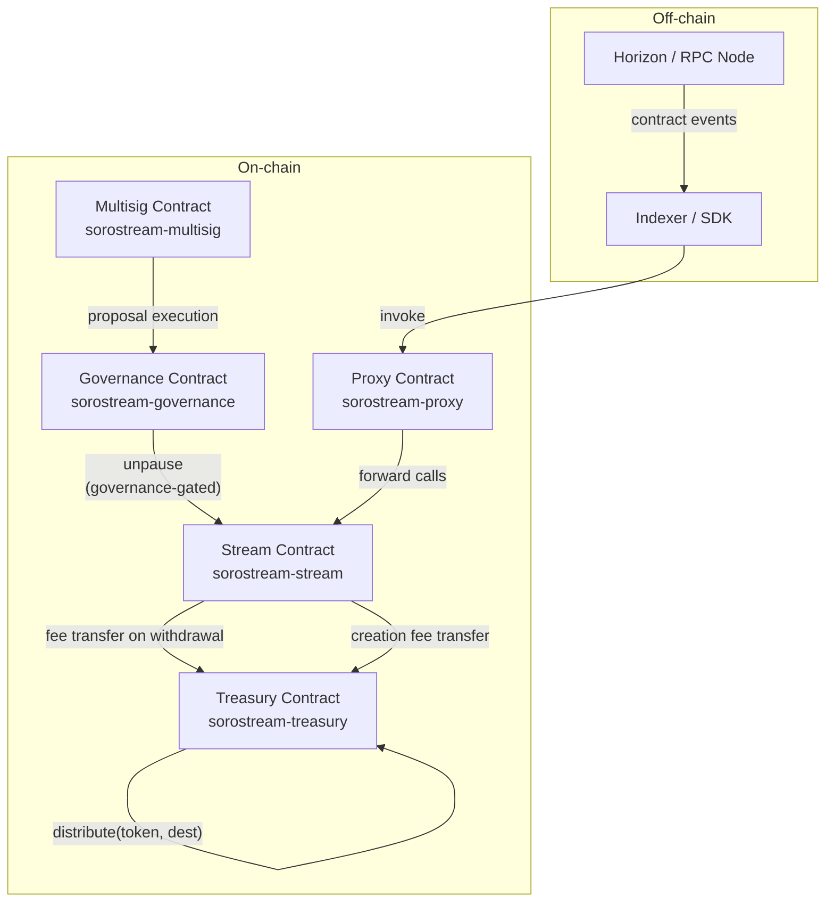

# SoroStream Architecture

## Stream Lifecycle State Machine

Every stream begins in the `Active` state immediately after `create_stream` succeeds. The diagram below shows all valid states and the instructions that trigger each transition.

```mermaid
stateDiagram-v2
    [*] --> Active : create_stream\n(sender locks deposit)

    Active --> Paused : pause_stream\n[caller = sender]
    Paused --> Active : resume_stream\n[caller = sender]\nend_time extended by paused duration

    Active --> Cancelled : cancel_stream\n[caller = sender or delegate]\nearned tokens → recipient\nremainder → sender

    Paused --> Cancelled : cancel_stream\n[caller = sender or delegate]\nearned tokens frozen at last_pause_time

    Active --> Cancelled : partial_cancel_stream\n[caller = sender or delegate]\ncreates a new smaller Active stream

    Active --> Cancelled : recipient_terminate\n[allow_recipient_termination = true]

    Paused --> Cancelled : recipient_terminate\n[allow_recipient_termination = true]

    Active --> Completed : withdraw\n[now ≥ end_time, auto_renew = false]\nall tokens distributed and stream removed

    Active --> Active : withdraw\n[auto_renew = true, sender has balance]\nnew epoch starts; end_time += duration

    Active --> Completed : withdraw\n[auto_renew = true, sender balance insufficient]\nAutoRenewFailed emitted

    Cancelled --> [*] : stream removed from storage
    Completed --> [*] : stream removed from storage

    Active --> [*] : archive_stream\n[fully settled: total_withdrawn + dust = deposit]
    Completed --> [*] : archive_stream
```



### State Descriptions

| State | Meaning |
|-------|---------|
| `Active` | Tokens are flowing; the recipient accrues `flow_rate` stroops per second. |
| `Paused` | Flow is frozen at `last_pause_time`; no new tokens accrue. `end_time` will be extended by the paused duration on resume. |
| `Cancelled` | The stream was ended early. Earned tokens went to the recipient; the unstreamed remainder returned to the sender. The storage entry is deleted. |
| `Completed` | The stream reached its natural `end_time`. All tokens have been distributed. The storage entry is deleted. |

### Guard Conditions

| Transition | Guard |
|-----------|-------|
| `pause_stream` | Caller must be the stream's `sender`. Stream must be `Active`. Contract must not be globally paused. |
| `resume_stream` | Caller must be the stream's `sender`. Stream must be `Paused`. Contract must not be globally paused. |
| `cancel_stream` | Caller must be `sender` or the appointed `delegate`. Stream must be `Active` or `Paused`. |
| `partial_cancel_stream` | Same as `cancel_stream`. `cancel_amount < remaining` and `remaining - cancel_amount ≥ flow_rate`. |
| `recipient_terminate` | `allow_recipient_termination` flag must be `true` on the stream. Caller must be the stream's `recipient`. |
| `withdraw` (mid-stream) | Caller must be `recipient`. Stream must be `Active`. `now ≥ cliff_time`. `now ≥ lock_until`. Withdrawal cooldown (if set) must have elapsed. |
| `withdraw` (auto-renew success) | Above, plus `now ≥ end_time`, `auto_renew = true`, sender balance ≥ deposit. Requires sender auth. |
| `archive_stream` | Caller must be `sender` or `recipient`. `total_withdrawn + dust = deposit` (stream fully settled). |

---

## Contract System Overview

The protocol is split across five contracts. The arrows show call relationships.



### Contract Roles

| Contract | Role |
|----------|------|
| `stream` | Core payment streaming logic: create, withdraw, cancel, top-up, pause, fee collection. |
| `treasury` | Holds accumulated protocol fees. Supports `deposit`, `withdraw_treasury`, `withdraw_all`, and `distribute` (treasury/LP split). |
| `governance` | Time-locked admin actions; can call `unpause` on the stream contract. |
| `multisig` | Multi-signature threshold for executing governance proposals. |
| `proxy` | Transparent upgrade proxy; forwards calls to the current stream contract implementation. |

---

## Stream ID Derivation

Stream IDs are deterministic and derived as:

```
stream_id = u64::from_be_bytes(sha256(
    sender_xdr || recipient_xdr || start_time_be8 || nonce_be8
)[0..8])
```

This means:
- The same `(sender, recipient, start_time, nonce)` tuple always produces the same ID.
- Callers must use a fresh `nonce` for each new stream to avoid collisions (`DuplicateStream` / `StreamIdConflict` errors).
- The `get_nonce(sender)` query returns the next expected batch nonce for `batch_create_stream`.

---

## Storage Layout (Summary)

| Key | Storage tier | Type | Description |
|-----|-------------|------|-------------|
| `"admin"` | Instance | `Address` | Contract admin |
| `"paused"` | Instance | `bool` | Global pause flag |
| `"fee_bps"` | Instance | `u32` | Protocol fee in basis points |
| `"treasury"` | Instance | `Address` | Treasury contract address |
| `"cf_xlm"` | Instance | `i128` | Flat XLM creation fee (stroops) |
| `"p_exp"` | Instance | `u64` | Auto-unpause expiry timestamp |
| `"pnd_fee"` | Instance | `(u32, u64)` | Pending fee proposal (bps, unlock_time) |
| `stream_id` (u64) | Persistent | `Stream` | Full stream struct |
| `("si", sender)` | Persistent | `Vec<u64>` | Stream IDs by sender |
| `("ri", recipient)` | Persistent | `Vec<u64>` | Stream IDs by recipient |
| `("gi", idx)` | Persistent | `u64` | Global stream index |

For the full storage specification see [`docs/STORAGE.md`](./docs/STORAGE.md) and [`docs/storage-layout.md`](./docs/storage-layout.md).

> Closes [#263](https://github.com/SoroStream/sorostream-contracts/issues/263).
